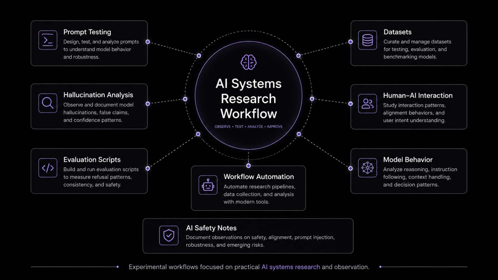

# Fatih Bülbül
AI Creative Systems • Ecommerce Automation • Digital Branding

I build AI-powered creative workflows, ecommerce systems, visual branding assets, and scalable digital experiences across Amazon, Shopify, Etsy, and content platforms.
## MarketAI

AI-powered ecommerce research and trend analysis system.

### Features
- Google Trends analysis
- Product demand research
- AI-generated market insights
- Competitor discovery
- Interactive analytics dashboard
- Ecommerce opportunity validation

### Stack
- Python
- Streamlit
- OpenAI API
- PyTrends
- Plotly
- BeautifulSoup

AI systems, ecommerce automation, AI safety observations, and workflow experimentation.

---

## Current Focus

- AI system behavior analysis
- Prompt engineering workflows
- Hallucination observation research
- Automation systems
- AI-assisted ecommerce infrastructure
- Human-AI interaction patterns

---

## Active Repositories

### AI Safety Observation Lab
Experimental observations on:
- hallucinations
- prompt injection
- alignment behaviors
- model robustness
- AI interaction patterns

### AI Ecommerce Assistant
AI-assisted ecommerce workflows including:
- SEO systems
- listing optimization
- automation pipelines
- branding workflows

### Automation Workflows
Experiments with:
- n8n
- AI workflows
- API systems
- productivity automations
- AI Content Systems
- Ecommerce Branding
- Amazon Listing Optimization
- Shopify Store Design
- AI Workflow Automation
- Prompt Engineering
- Creative Strategy
- Trend Research
- Data Visualization
---

## Research Interests

- AI alignment
- model behavior
- prompt robustness
- AI safety tooling
- workflow automation
- scalable AI systems

---

## Currently Learning

- Python
- LLM system design
- AI evaluation methods
- automation infrastructure
- AI safety research workflows

---

## Links & Contact

- GitHub: https://github.com/thenoktart
- Behance: https://www.behance.net/Thenoktart
- Upwork: https://www.upwork.com/freelancers/thenoktart
- Linkedln: https://www.linkedin.com/in/thenoktart/
- Email: thenoktart@gmail.com
---

Building practical AI systems while studying how humans and AI interact in real-world workflows.
## Current Projects

- AI safety observation workflows
- Prompt injection analysis
- Ecommerce automation systems
- AI-assisted research pipelines
- Workflow experimentation
